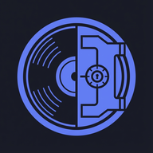
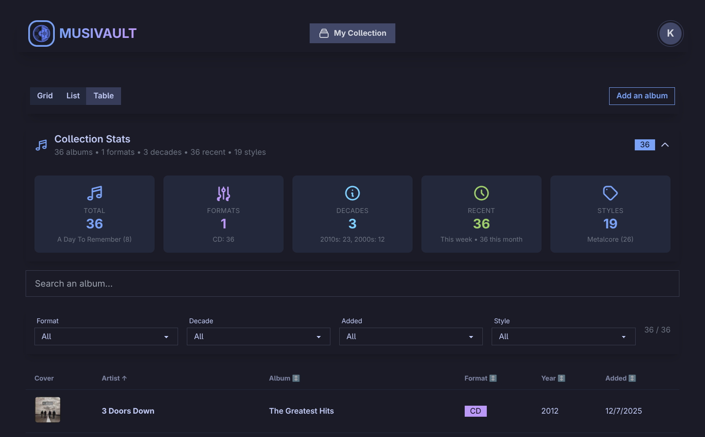
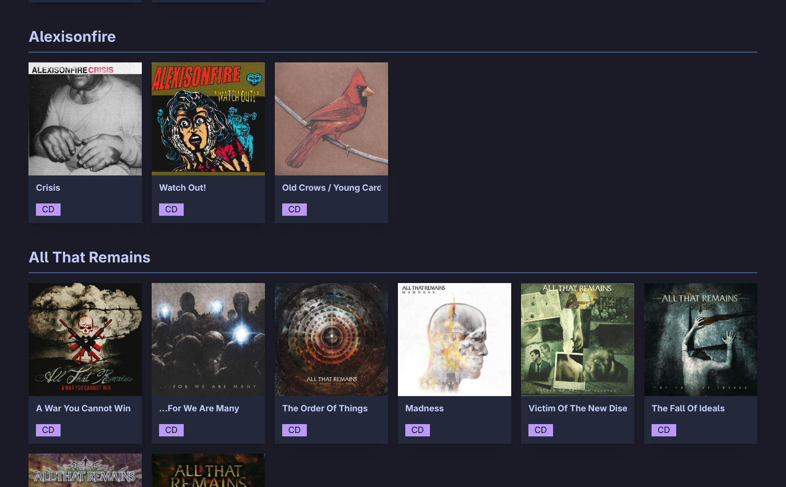
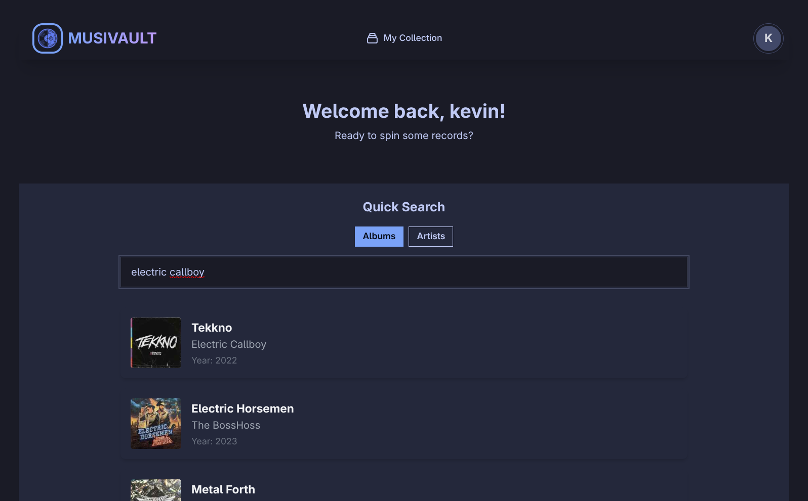
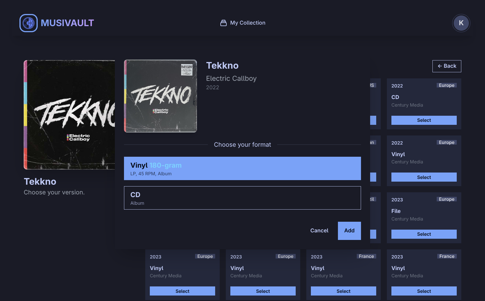
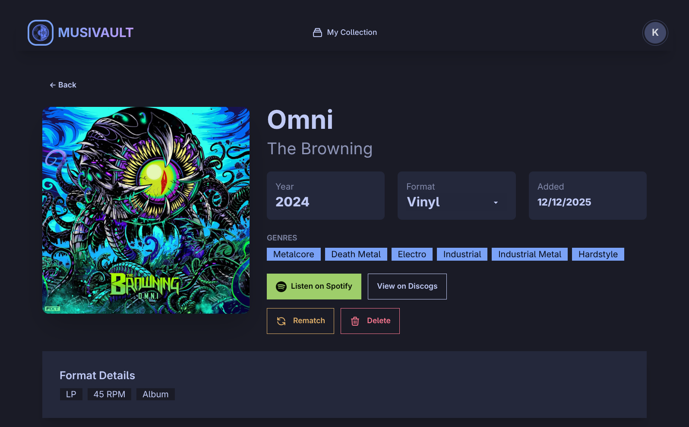
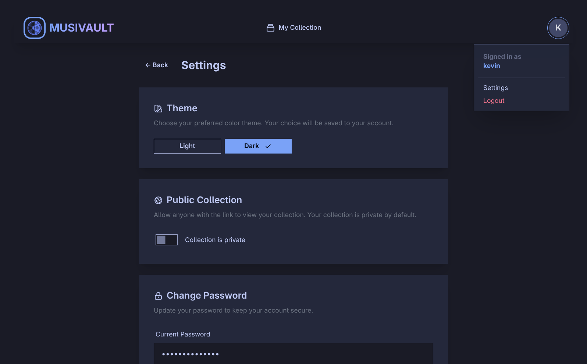
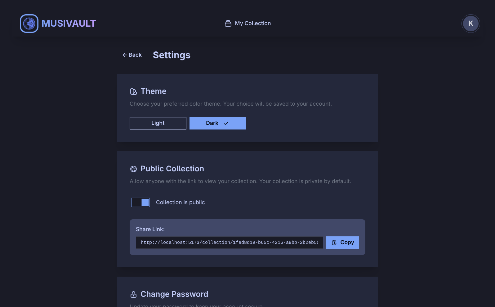

<p align="center">
  
</p>

<h1 align="center">Musivault</h1>

<p align="center">
  <strong>Your music collection, reimagined.</strong><br>
  A beautiful web application to catalog and explore your vinyl & CD collection.
</p>

<p align="center">
  
  
</p>

---

## Features

- **Discogs Integration** - Search and add albums using the Discogs database.
- **OIDC SSO Support** - Enterprise-ready authentication with OpenID Connect (e.g., Authentik, Keycloak).
- **PWA Ready** - Installable on mobile and desktop devices with offline capabilities.
- **Multi-user Support** - Secure private collections for multiple users.
- **Multi-languages** - Support internationalization (i18n) with initial translations for English, German (DE), and French (FR), along with a language selector in settings. This feature is back by [Weblate](https://hosted.weblate.org/projects/musivault/).
- **Collection Sharing** - Share your collection via public links with optional password protection.
- **Smart Insights** - View collection statistics, format distribution, and top artists.
- **Advanced Filtering** - Sort and filter by format, decade, date added, and more.
- **Condition Grading** - Track the media and sleeve condition of your albums. **(You need to opt-in in settings to use this feature)**
- **ID Lookup** - Quickly find releases by Discogs ID or Barcode.
- **Responsive Design** - Optimized for desktop, tablet, and mobile usage.
- **Dark/Light Mode** - Toggle between aesthetic themes.
- **Admin Dashboard** - Manage users and settings.
- **Docker Ready** - Simple deployment using Docker Compose.

## Screenshots

<p align="center">
  
  <br><em>Collection Dashboard - Overview with statistics and insights</em>
</p>

<p align="center">
  
  <br><em>Collection Grid - Browse your albums with cover art</em>
</p>

<p align="center">
  
  <br><em>Search - Find albums from the Discogs database</em>
</p>

<p align="center">
  
  <br><em>Version Selection - Choose the exact pressing you own</em>
</p>

<p align="center">
  
  <br><em>Album Detail - View tracklist and album information</em>
</p>

<p align="center">
  
  <br><em>Settings - Customize your profile and preferences</em>
</p>

<p align="center">
  
  <br><em>Public Collection - Share your collection with others</em>
</p>

## Quick Start

### Prerequisites

- [Docker](https://docs.docker.com/get-docker/) and Docker Compose
- [Discogs API credentials](https://www.discogs.com/settings/developers)

### Installation

```bash
# Clone the repository
git clone https://github.com/Jeanball/musivault.git
cd musivault

# Configure environment
cp .env.example .env
# Edit .env with your configuration

# Start the application
docker compose pull
docker compose up -d
```

Access the app at [http://localhost:3000](http://localhost:3000)

### Environment Variables

| Variable | Description | Default | Required |
|----------|-------------|---------|----------|
| `SESSION_SECRET` | Session encryption key | - | Yes |
| `DISCOGS_KEY` | Discogs API consumer key | - | Yes |
| `DISCOGS_SECRET` | Discogs API consumer secret | - | Yes |
| `MONGO_URI` | MongoDB connection string | mongodb://mongodb:27017/musivault | No |
| `PORT` | Application port | 3000 | No |
| `JWT_SECRET` | JWT signing secret | ${SESSION_SECRET} | No |
| `ADMIN_EMAIL` | Initial admin email | - | No |
| `ADMIN_USERNAME` | Initial admin username | - | No |
| `ADMIN_PASSWORD` | Initial admin password | - | No |
| `OIDC_ISSUER` | OIDC Issuer URL | - | No |
| `OIDC_CLIENT_ID` | OIDC Client ID | - | No |
| `OIDC_CLIENT_SECRET` | OIDC Client Secret | - | No |
| `OIDC_REDIRECT_URI` | OIDC Redirect URI | - | No |
| `OIDC_PROVIDER_NAME` | Name of the SSO provider | SSO | No |
| `FRONTEND_URL` | URL of the frontend (for CORS/Auth) | - | No |
| `IMAGE_TAG` | Docker image tag to use | latest | No |
| `ENABLE_BACKGROUND_MIGRATION` | Run heavy DB migrations in background | false | No |
| `BACKEND_HOST` | Backend hostname for Nginx | musivault-backend | No |
| `BACKEND_PORT` | Backend port for Nginx | 5000 | No |

## Tech Stack

| Frontend | Backend | Infrastructure |
|----------|---------|----------------|
| React 19 | Node.js + Express | Docker |
| TypeScript | MongoDB + Mongoose | Nginx |
| Vite | JWT Authentication | GitHub Actions |
| TailwindCSS + DaisyUI | | |

## Development

```bash
# Install dependencies
npm install
cd frontend && npm install
cd ../backend && npm install

# Run development servers
npm run dev
```

Or with Docker:
```bash
docker compose -f docker-compose.dev.yml up --build
```

## Docker Images

Pre-built images are available on GitHub Container Registry:

```
ghcr.io/jeanball/musivault/backend:latest
ghcr.io/jeanball/musivault/frontend:latest
```

## Management

```bash
docker compose logs -f          # View logs
docker compose restart          # Restart services
docker compose down             # Stop application
docker compose pull && up -d    # Update to latest
```

## Contributing

1. Fork the repository
2. Create your feature branch (`git checkout -b feature/amazing-feature`)
3. Commit your changes (`git commit -m 'Add amazing feature'`)
4. Push to the branch (`git push origin feature/amazing-feature`)
5. Open a Pull Request

## License

MIT License - see [LICENSE](LICENSE) for details.
