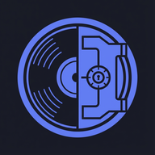
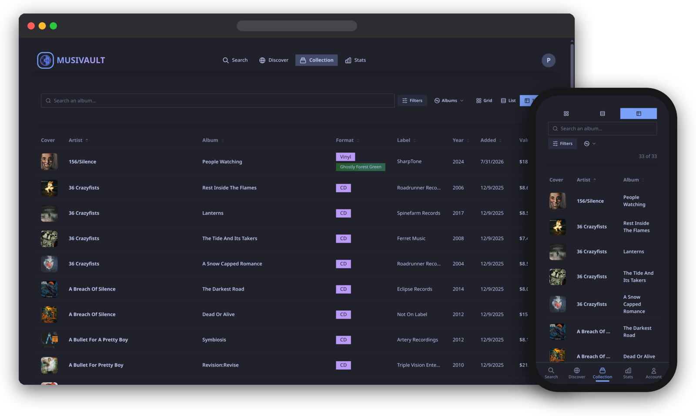
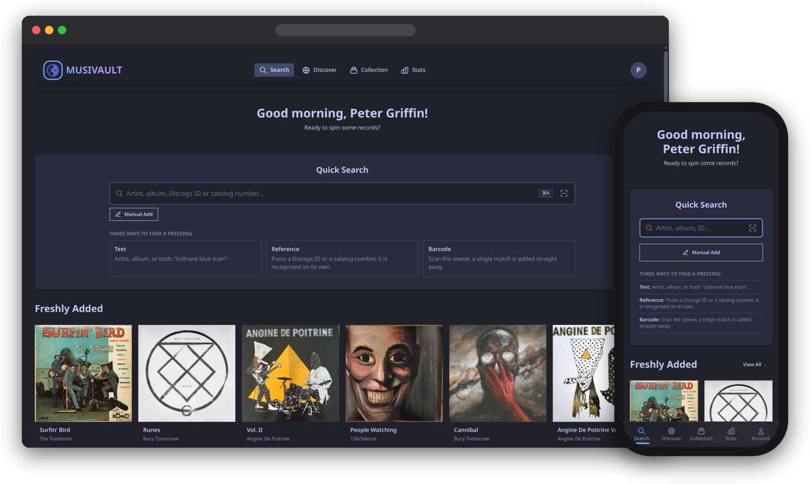
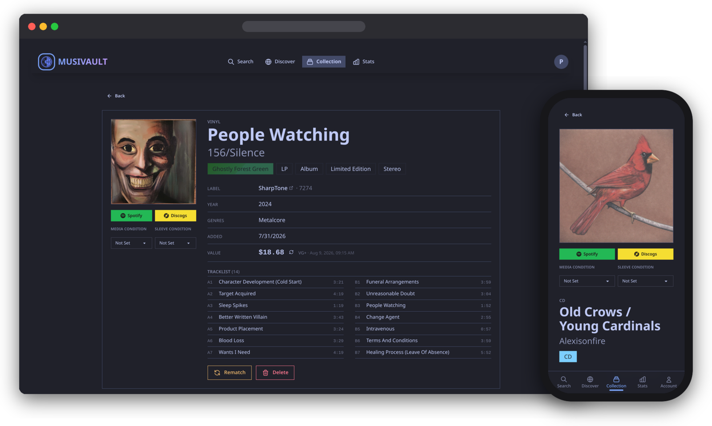
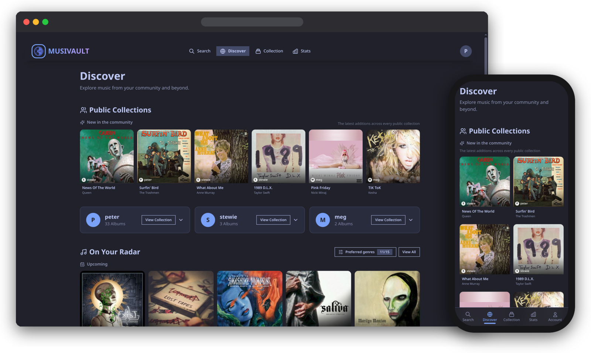
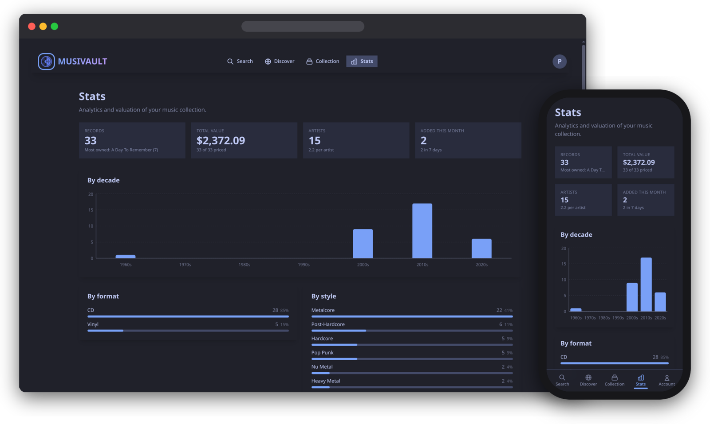

<p align="center">
  
</p>

<h1 align="center">Musivault</h1>

<p align="center">
  <strong>Your music collection, reimagined.</strong><br>
  A beautiful web application to catalog and explore your vinyl & CD collection.
</p>

<p align="center">
  
  
</p>

---

## Features

### Your collection

- **Discogs Integration** : search and add albums by artist, title, Discogs ID or barcode, and pick the exact pressing you own.
- **Condition Grading** : track the media and sleeve condition of your albums (opt-in from settings).
- **Price Tracking** : follow item values from the Discogs marketplace ([setup](#optional-setup-price-tracking)).
- **Smart Insights** : collection statistics, format distribution and top artists.
- **Advanced Filtering** : sort and filter by format, decade, date added and more.
- **Custom Fields** : add your own per-album fields (purchase price, storage location, notes) as short text or long text, ordered the way you want.
- **Import & Export** : import a Discogs CSV straight in, matched by release ID, catalog number, then artist and title, with a detailed log of every row. Export the whole collection back to CSV at any time.

### Discover

- **Public collection** : publish your collection through a public link, with optional password protection, and browse what the community is listening to.
- **On Your Radar** : recent and upcoming album releases in the styles you already collect, from MusicBrainz (no key needed).
- **Near You** : independent record shops around you from OpenStreetMap (no key needed), and upcoming concerts matching the artists and styles in your collection ([setup](#optional-setup-nearby-concerts)).

Releases and concerts are both filtered by the same **preferred genres**, deduced from your collection and editable right from the Discover page.

### Self-hosting

- **Multi-user** : private collections per user, plus OIDC SSO for Authentik, Keycloak and friends.
- **Multi-language** : English, German and French, translated on [Weblate](https://hosted.weblate.org/projects/musivault/).
- **Runs anywhere** : Docker Compose deployment, installable PWA, responsive layout, dark and light themes.
- **Admin dashboard** : users, background tasks and execution logs.

## Screenshots

<p align="center">
  
  <br><em>Collection - Browse your albums in grid, list or table view, on any screen</em>
</p>

<p align="center">
  
  <br><em>Search - One field that recognises an artist, an album, a Discogs ID or a barcode</em>
</p>

<p align="center">
  
  <br><em>Album Detail - Tracklist, pressing details and market value</em>
</p>

<p align="center">
  
  <br><em>Discover - Record shops near you, concerts and releases matching your collection</em>
</p>

<p align="center">
  
  <br><em>Stats - Analytics and valuation of your collection</em>
</p>

> Settings, import/export, the admin dashboard and every other view are in
> [`docs/screenshots/`](docs/screenshots/), each one in desktop, mobile and combined form.

## Quick Start

### Prerequisites

- [Docker](https://docs.docker.com/get-docker/) and Docker Compose
- [Discogs API credentials](https://www.discogs.com/settings/developers)

### Installation

```bash
# Clone the repository
git clone https://github.com/Jeanball/musivault.git
cd musivault

# Configure environment
cp .env.example .env
# Edit .env with your configuration

# Start the application
docker compose pull
docker compose up -d
```

Access the app at [http://localhost:3000](http://localhost:3000)

### Environment Variables

| Variable | Description | Default | Required |
|----------|-------------|---------|----------|
| `SESSION_SECRET` | Session encryption key | - | Yes |
| `DISCOGS_KEY` | Discogs API consumer key | - | Yes |
| `DISCOGS_SECRET` | Discogs API consumer secret | - | Yes |
| `DISCOGS_PAT` | Discogs Personal Access Token | - | No |
| `TICKETMASTER_API_KEY` | Ticketmaster Consumer Key, for nearby concerts | - | No |
| `MONGO_URI` | MongoDB connection string | mongodb://mongodb:27017/musivault | No |
| `PORT` | Application port | 3000 | No |
| `JWT_SECRET` | JWT signing secret | ${SESSION_SECRET} | No |
| `ADMIN_EMAIL` | Initial admin email | - | No |
| `ADMIN_USERNAME` | Initial admin username | - | No |
| `ADMIN_PASSWORD` | Initial admin password | - | No |
| `OIDC_ISSUER` | OIDC Issuer URL | - | No |
| `OIDC_CLIENT_ID` | OIDC Client ID | - | No |
| `OIDC_CLIENT_SECRET` | OIDC Client Secret | - | No |
| `OIDC_REDIRECT_URI` | OIDC Redirect URI | - | No |
| `OIDC_PROVIDER_NAME` | Name of the SSO provider | SSO | No |
| `FRONTEND_URL` | URL of the frontend (for CORS/Auth) | - | No |
| `IMAGE_TAG` | Docker image tag to use | latest | No |
| `PRICE_CACHE_TTL_HOURS` | Price cache TTL in hours | 168 | No |
| `BACKEND_HOST` | Backend hostname for Nginx | musivault-backend | No |
| `BACKEND_PORT` | Backend port for Nginx | 5000 | No |

### Optional Setup: Price Tracking

<details>
<summary>Needs a Discogs Personal Access Token and a (free) seller account.</summary>

1. **Enroll as a Discogs Seller**: You must have a seller account (it's free). Visit [Discogs Seller Settings](https://www.discogs.com/settings/seller/) to enroll.
2. **Keep Discogs Currency as USD**: In your Discogs Seller Settings, ensure your currency is set to **USD**. Do not change it there! You will configure your local display currency directly within Musivault's settings.
3. **Generate a Token**: Go to [Discogs Developer Settings](https://www.discogs.com/settings/developers), click **"Generate new token"**.
4. **Configure Musivault**: Add the generated token as `DISCOGS_PAT` in your `.env` file or `docker-compose.yml`.

Once configured, prices can be fetched immediately from the **Admin Task Center**, or by restarting the backend server until the `2026-03-28_album-data-backfill` migration has succeeded.

</details>

### Optional Setup: Nearby Concerts

<details>
<summary>Needs a free Ticketmaster API key. Record shops work without any key.</summary>

The **Shows Near You** section of Discover lists upcoming concerts around you, ranked by how well they fit your collection: acts you already own records from first, then anything in a matching genre.

1. **Create an account**: Register at [developer.ticketmaster.com](https://developer.ticketmaster.com), approval is instant.
2. **Copy the Consumer Key**: Your default app is created automatically. Take its **Consumer Key**; the Consumer Secret issued alongside it belongs to the Commerce APIs and is *not* used here.
3. **Configure Musivault**: Add it as `TICKETMASTER_API_KEY` in your `.env` file or `docker-compose.yml`, then restart the backend.

The free tier allows 5000 calls a day. Results are cached per geographic area for 6 hours and only refreshed when someone actually opens the page, so a typical instance uses a few dozen calls a day. Leave the variable empty to hide the section entirely.

> **Coverage note:** Ticketmaster's catalogue is strongest in North America, the UK, Ireland and Australia, and thinner elsewhere. Record shops are unaffected, they come from OpenStreetMap and need no key.

</details>

## Tech Stack

| Frontend | Backend | Infrastructure |
|----------|---------|----------------|
| React 19 | Node.js + Express | Docker |
| TypeScript | MongoDB + Mongoose | Nginx |
| Vite | JWT Authentication | GitHub Actions |
| TailwindCSS + DaisyUI | | |

## Development

```bash
# Install dependencies
npm install
cd frontend && npm install
cd ../backend && npm install

# Run development servers
npm run dev
```

Or with Docker:
```bash
docker compose -f docker-compose.dev.yml up --build
```

## Docker Images

Pre-built images are available on GitHub Container Registry:

```
ghcr.io/jeanball/musivault/backend:latest
ghcr.io/jeanball/musivault/frontend:latest
```

## Management

```bash
docker compose logs -f          # View logs
docker compose restart          # Restart services
docker compose down             # Stop application
docker compose pull && up -d    # Update to latest
```

## Contributing

1. Fork the repository
2. Create your feature branch (`git checkout -b feature/amazing-feature`)
3. Commit your changes (`git commit -m 'Add amazing feature'`)
4. Push to the branch (`git push origin feature/amazing-feature`)
5. Open a Pull Request

## License

MIT License - see [LICENSE](LICENSE) for details.
